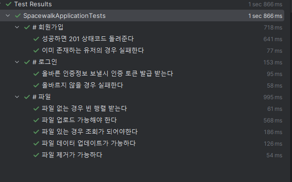

# 스페이스워크 과제 제출

## 파일 저장 API

### POST /signup
회원가입을 위한 엔드포인트. ID/PW 제공한 이후 중복된 ID가 존재하지 않으면 회원가입 성공한다.

### POST /login
로그인을 위한 엔드포인트. ID/PW가 유효한 경우 인증 토큰을 발급한다.

### GET /files  
로그인한 유저의 파일 목록 조회한다

### POST /file/upload  
로그인한 유저의 파일 목록에 파일 추가한다

### GET /file/{id}  
로그인한 유저의 특정 파일을 다운로드한다

### PATCH /file/{id}  
로그인한 유저의 특정 파일을 다른 파일 내용물로 대체한다

### DELETE /file/{id}  
로그인한 유저의 특정 파일을 제거한다


## 테스트 실행

### 필요사항

* Docker / docker-compose
* Java (11 이상)


### 절차

* 데이터베이스 컨테이너를 실행합니다.
```
docker-compose -f docker-compose.yaml up -d postgres
```

* gradle을 통해 테스트 실행합니다.
```
./gradlew :test
```

